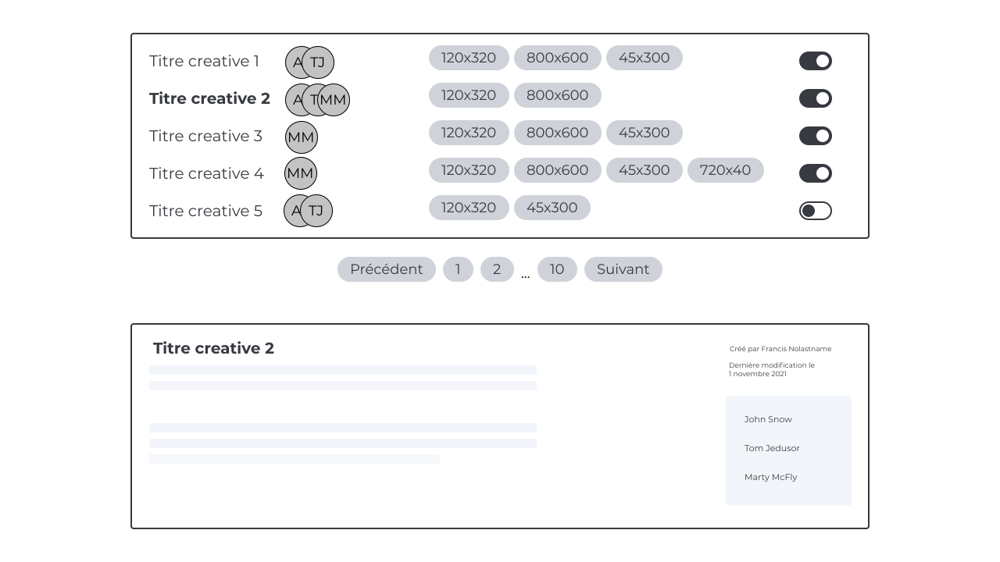
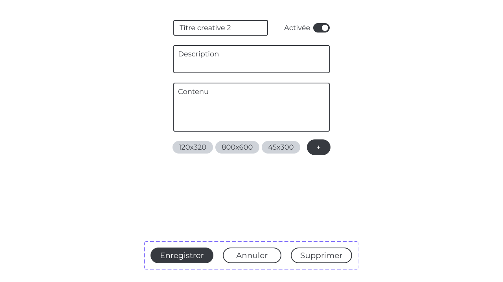

# Test frontend Mediakeys Tech

L'objectif est de réaliser une application [ReactJS](https://reactjs.org/) en [Typescript](https://github.com/microsoft/TypeScript) d'édition de bannières de publicité simples.

Le projet est bootstrappé avec [Create React App](https://github.com/facebook/create-react-app).

L'utilisation des bibliothèques suivantes est attendue :

- [material-ui](https://github.com/mui-org/material-ui)
- [react-query](https://github.com/tannerlinsley/react-query)
- [react-router](https://github.com/remix-run/react-router)

## Mockups

Le thème et certains comportements UI/UX sont laissés libres, mais l'UI de l'application devra respecter au minimum les maquettes disponibles dans le dossier `mockups`\
Tout ajout ou modification qui sera jugé utile à l'UI/UX sera bienvenu et devra être justifié.





## API

Il est fourni une API simplifiée réalisée avec [JSON Server](https://github.com/typicode/json-server) disponible à l'adresse suivante : http://localhost:3001

Pour lancer l'API en dev : `yarn server`

### Endpoints

```
GET    /user

GET    /creatives
GET    /creatives/:uuid
POST   /creatives
PUT    /creatives/:uuid
DELETE /creatives/:uuid
```

Pagination : `/creatives?_page=:page&_limit=:limit`\
Tri : `/creatives?_sort=lastModified&_order=desc`

## Commandes

Pour démarrer le projet : `yarn start`

Démarre l'application en mode développement, disponible à l'adresse [http://localhost:3000](http://localhost:3000).

Pour lancer les tests : `yarn test`

## Livrable

- application JS, disponible sur un repo git
- besoins fonctionnels : lister, éditer et supprimer des bannières
- affichage responsive desktop/mobile, selon les mockups fournis
- quelques tests jugés pertinents écrits avec Jest

Il sera porté attention à l'architecture du projet, aux éventuelles bibliothèques supplémentaires utilisées et à la qualité du code produit.
